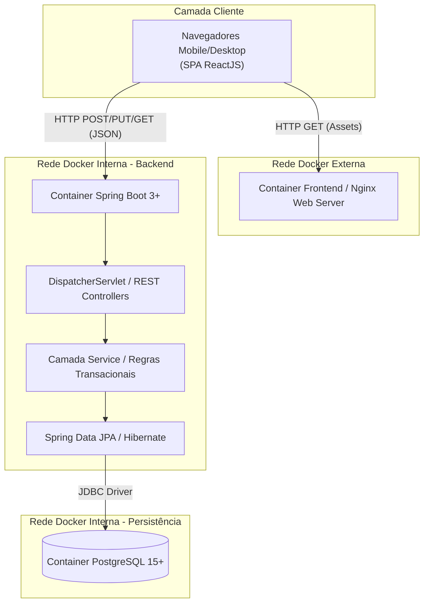
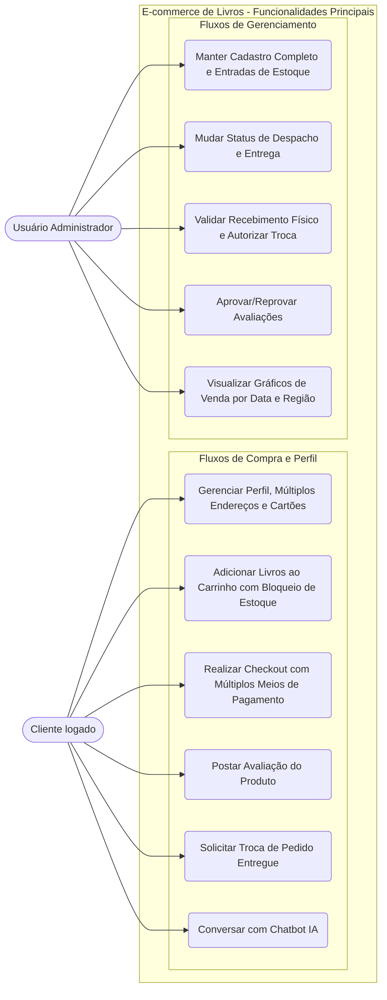
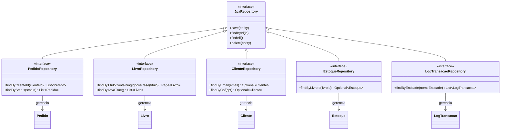
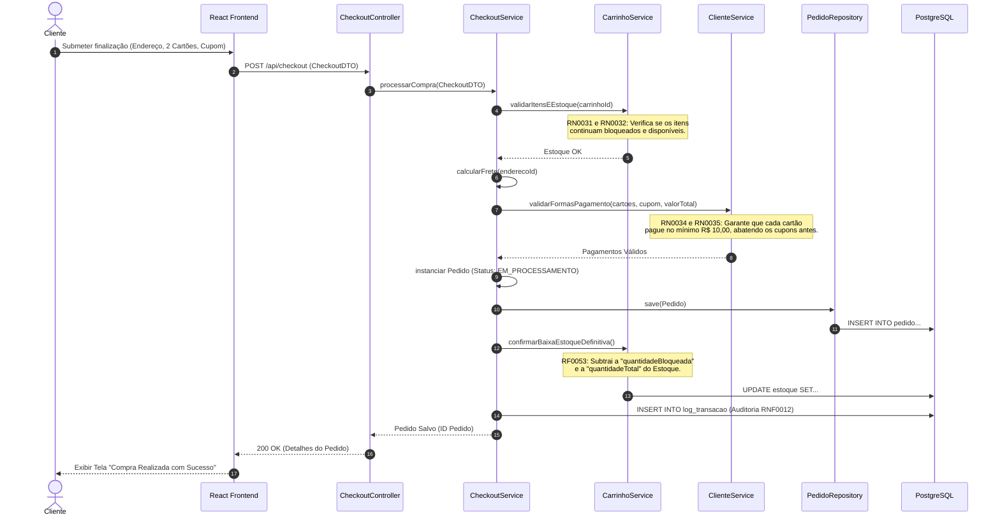
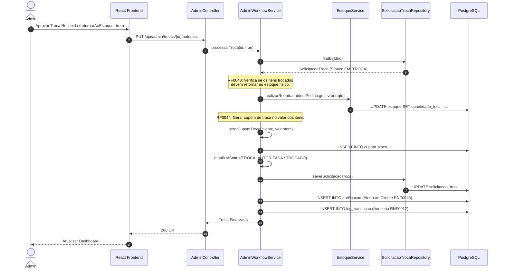
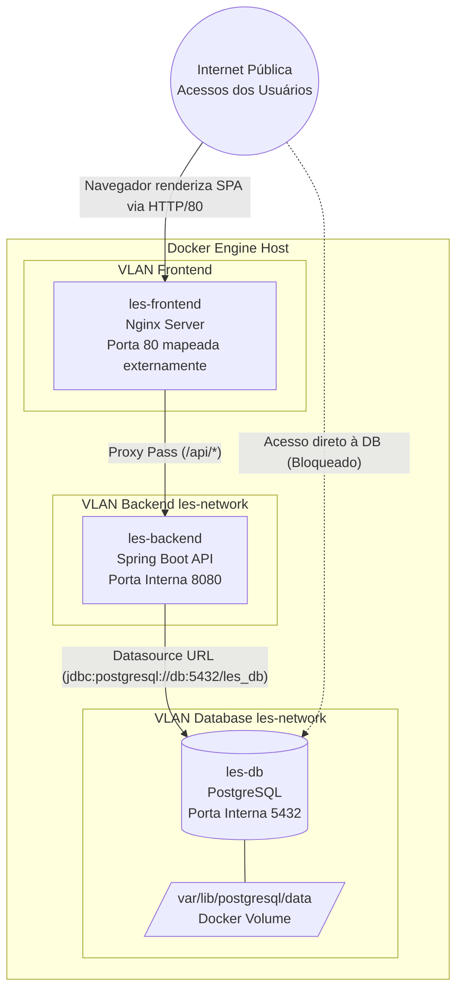
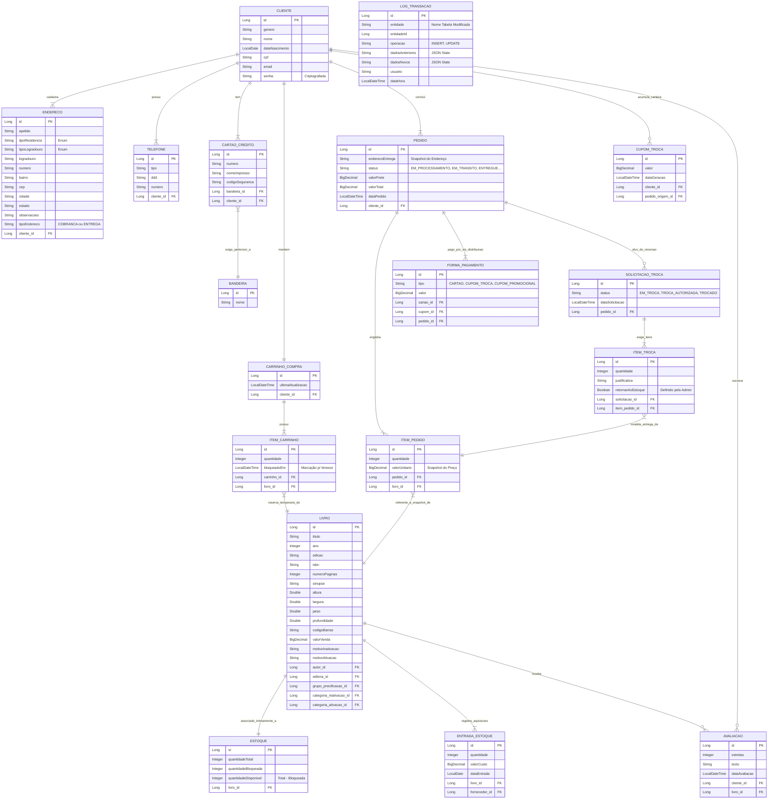

# Documento de Visão de Projeto

**E-COMMERCE DE LIVROS**

**Histórico de Versões**

| Data | Versão | Descrição | Autor | Revisor |
| :---: | :---: | :---: | :---: | :---: |
| 27/03/2026 | 1.0 | Elaboração e padronização do Documento de Visão de Projeto | Assistente de IA | Kauê Benk |

| Cliente | Disciplina LES - 1º Semestre de 2026 |
| ----: | :---- |
| **Documento** | Documento de Visão de Projeto: *E-commerce de Livros* |
| **Data** | 27 de março de 2026 |
| **Autor** | Kauê Benk |

---

**Índice**  
1. Objetivo
   1.1 Escopo
   1.2 Referências
2. Necessidades de Negócio
3. Objetivo do Projeto
4. Declaração Preliminar de Escopo
   4.1 Descrição
   4.2 Produtos a serem entregues
   4.3 Requisitos
       4.3.1 Requisitos Funcionais
       4.3.2 Requisitos Não Funcionais
       4.3.3 Regras de Negócio
5. Premissas
6. Influência das Partes Interessadas
7. Representação Arquitetural
   7.1 Restrições Arquiteturais
   7.2 Objetivos e Restrições Arquiteturais
8. Visão de Use Case
   8.1 Diagrama de Casos de Uso
   8.2 Descrição dos Casos de Uso Arquiteturalmente Significativos
9. Visão de Lógica
   9.1 Camada de Apresentação
   9.2 Camada de Negócio
   9.3 Camada de Persistência
   9.4 Realização dos Casos de Uso Significativos
10. Visão de Implantação
11. Visão de Implementação
12. Visão de Dados
13. Tamanho e Performance
14. Qualidade
15. Cronograma Macro
16. Referências

---

## 1. Objetivo

Este documento trata principalmente da documentação das necessidades de negócios, da justificativa do projeto, do entendimento atual das necessidades do cliente e descreve detalhadamente o novo produto de software que deve satisfazer esses requisitos.  
Tem o objetivo de alinhar as expectativas dos interessados para formalizar a base do projeto. Apresenta uma visão arquitetural e estrutural extremamente detalhada do **E-commerce de Livros**, evidenciando a infraestrutura, diagramas de classe, entidades e regras a serem aplicadas no sistema desenvolvido para a disciplina de Laboratório de Engenharia de Software (LES), assegurando o mais alto nível de excelência técnica.

### 1.1 Escopo
O escopo deste documento trata do desenvolvimento de uma solução web completa que atenda todas as necessidades de um e-commerce especializado na venda de livros. O escopo foca em documentar as partes significativas do ponto de vista da arquitetura do modelo de design, como sua divisão em subsistemas, pacotes, interfaces, persistência de banco de dados mapeada e implantação, abrangendo Frontend (React), Backend (Spring Boot) e Banco de Dados (PostgreSQL).

### 1.2 Referências
Para a construção deste documento foram utilizadas as seguintes referências:
* DRS_LES_1_2026.md (Documento de Requisitos do Sistema)
* Template DVP.docx.md
* Código-fonte atualizado do repositório (refletindo a implementação real das Entidades e Regras).

Este documento influencia:
* Modelagem detalhada do Banco de Dados Relacional.
* Arquitetura de software do Repositório.

## 2. Necessidades de Negócio

Um sistema informatizado para controle de um e-commerce de livros é necessário para que a livraria consiga ter total controle de todos os livros no acervo, automatizar e proteger o controle de estoque, bem como centralizar um gerenciamento completo de seus clientes, vendas, cupons de desconto/troca e logística complexa de entrega e devolução.
Além disso, com o aumento da competitividade, é vital que o sistema forneça ferramentas de análise em gráficos de vendas consolidados por período e região e a integração com **IA Generativa** para criar um fluxo automatizado de recomendações personalizadas e interações de suporte ao cliente, melhorando a retenção.

## 3. Objetivo do Projeto

Desenvolver uma plataforma de soluções web conteinerizada de nível corporativo, capaz de:
* Armazenar informações de forma íntegra e segura em uma base de dados relacional PostgreSQL, mantendo histórico de auditoria completo (Logs).
* Utilizar o protocolo HTTP/REST para comunicação desacoplada entre uma camada de apresentação reativa (React SPA) e a camada de negócios (Spring Boot).
* Ser executado nativamente em qualquer navegador moderno.
* Gerenciar todo o fluxo do comércio eletrônico: vitrine interativa, carrinho de compras com bloqueio temporário de estoque, checkout robusto (suportando múltiplos cartões e cupons de forma matemática), despacho, entrega e fluxo reverso de trocas.
* Uso de Inteligência Artificial Generativa para recomendações dinâmicas de títulos. 
* Produzir dashboards visuais com relatórios gerenciais estruturados sobre o comportamento de vendas e regiões do Brasil.

## 4. Declaração Preliminar de Escopo

Esta seção descreve o escopo profundo do projeto, garantindo o rastreio total do DRS.

### 4.1 Descrição
A aplicação é um e-commerce B2C voltado para a venda de livros com foco na usabilidade e controle de backend. O cliente se cadastra, insere múltiplos cartões de crédito e múltiplos endereços. Ao navegar no catálogo (filtrável e com interações de Chatbot de IA), ele adiciona itens ao carrinho, acionando gatilhos temporizados de bloqueio de estoque. No checkout, regras de divisão de pagamento garantem transações precisas mesclando cartões e cupons (respeitando o mínimo de R$10 por cartão). Após a entrega, os clientes podem avaliar os livros ou iniciar um fluxo de troca, onde administradores validam o retorno físico ao estoque e o sistema emite um cupom de crédito. Administradores também possuem acesso gerencial total ao controle de inventário, margens de lucro, ativação/inativação automática de produtos e gráficos analíticos.

### 4.2 Produtos a serem entregues
Os seguintes itens são considerados produtos do projeto:
* Módulo de Frontend: Aplicação Single Page Application desenvolvida em React.js (com build via Vite).
* Módulo de Backend: API RESTful robusta desenvolvida em Java/Spring Boot.
* Banco de Dados Relacional: PostgreSQL configurado, com Schemas e tabelas geradas e migrações JPA validadas.
* Arquivos de orquestração de infraestrutura (`docker-compose.yml` e `Dockerfiles`).
* Bateria extensa de testes automatizados (Cypress para E2E e fluxos críticos no frontend).

### 4.3 Requisitos

Todos os requisitos do `DRS_LES_1_2026.md` estão rigorosamente listados abaixo para balizar o desenvolvimento e a arquitetura.

#### 4.3.1 Requisitos Funcionais

**Grupo: Cadastro de Livros**
* **RF0011**: Cadastrar livro em registro único.
* **RF0012**: Inativar cadastro de livro manualmente (exigindo justificativa).
* **RF0013**: Inativar livro de forma automática (condição: sem estoque e poucas vendas fora da margem parametrizada).
* **RF0014**: Alterar cadastro de livro.
* **RF0015**: Consulta de livros baseada em filtros combinados e isolados.
* **RF0016**: Ativar cadastro de livros.

**Grupo: Cadastro de Clientes**
* **RF0021**: Cadastrar cliente (validação de dados obrigatórios).
* **RF0022**: Alterar dados cadastrais do cliente.
* **RF0023**: Inativar cadastro de cliente.
* **RF0024**: Consulta de clientes com base em múltiplos filtros.
* **RF0025**: Consulta de histórico de transações dentro do perfil do cliente.
* **RF0026**: Cadastro de múltiplos endereços de entrega (identificados por apelido/frase curta).
* **RF0027**: Cadastro de múltiplos cartões de crédito (com seleção de um preferencial).
* **RF0028**: Alteração isolada e simplificada de senha.

**Grupo: Gerenciar Vendas Eletrônicas**
* **RF0031**: Gerenciar carrinho de compra (repositório temporário, adicionar, alterar, excluir, visualizar).
* **RF0032**: Definir/editar quantidade de itens no carrinho.
* **RF0033**: Realizar compra a partir do carrinho estabilizado.
* **RF0034**: Calcular frete (baseado nos itens e no endereço selecionado).
* **RF0035**: Selecionar endereço de entrega (ou cadastrar novo no próprio fluxo de checkout e atrelar ao perfil).
* **RF0036**: Selecionar forma de pagamento suportando complexidade: múltiplos cartões, mesclados com cupons de troca e cupons promocionais simultâneos.
* **RF0037**: Finalizar Compra gerando transação com status inicial "EM PROCESSAMENTO".
* **RF0038**: Despachar produtos (Admin altera de aprovada para "EM TRÂNSITO").
* **RF0039**: Confirmar entrega (Admin altera para "ENTREGUE").
* **RF0040**: Solicitar troca (Cliente visualiza pedido ENTREGUE e seleciona item para troca).
* **RF0041**: Autorizar trocas (Admin altera o status de EM TROCA para TROCA AUTORIZADA).
* **RF0042**: Visualização em painel administrativo das trocas solicitadas.
* **RF0043**: Confirmar recebimento físico de itens para troca e sinalizar se devem dar reentrada no estoque.
* **RF0044**: Gerar cupom de troca automatizado após recebimento dos itens, vinculado ao perfil do cliente.

**Grupo: Controle de Estoque**
* **RF0051**: Realizar entrada em estoque (associando fornecedor, quantidade, valor de custo e livro).
* **RF0052**: Calcular valor de venda com base no maior valor de custo inserido + percentual de margem do grupo de precificação.
* **RF0053**: Dar baixa definitiva em estoque ao confirmar o pagamento de uma venda.
* **RF0054**: Realizar reentrada em estoque a partir de item devolvido/trocado.

**Grupo: Análise**
* **RF0055**: Dashboard: Analisar histórico de vendas comparando produtos/categorias por período (Data Início/Fim).
* **RF00064**: Dashboard: Analisar histórico de vendas agrupado por região/estado do Brasil.

**Grupo: Avaliações**
* **RF00063**: Cadastro de avaliações (estrelas e texto) restrito a clientes com compras finalizadas.
* **RF00065**: Gestão de avaliações (capacidade do Administrador em moderar/aprovar).

#### 4.3.2 Requisitos Não Funcionais
* **RNF0011**: Tempo de resposta: Consultas ao banco devem retornar dados em no máximo 1 segundo.
* **RNF0012**: Log de transação (Auditoria de Banco de Dados): Toda operação de Inserção/Alteração deve salvar data, hora, usuário responsável e cópia de dados antigos/novos.
* **RNF0021**: Código de livro (Geração de identificador único).
* **RNF0013**: Cadastro de domínios via scripts de inicialização de base de dados.
* **RNF0031**: Senha forte exigida (8+ caracteres, Upper, Lower, Especial).
* **RNF0032**: Confirmação da senha ("Digite novamente") na interface de UI.
* **RNF0033**: Criptografia irreversível (Hash) para senhas salvas.
* **RNF0034**: Separação na UI para edição de Endereços independentemente do resto do perfil.
* **RNF0035**: Código único identificador gerado para clientes.
* **RNF0042**: Apresentar na interface do carrinho itens expirados (removidos pelo tempo de sessão) com botão de "comprar" desabilitado.
* **RNF0043**: Utilização visual de Gráfico de Linhas para o Histórico de Vendas.
* **RNF0044**: Arquitetura deve prever IA Generativa para atuar como chatbot e motor de recomendação treinado com as vendas do e-commerce.

#### 4.3.3 Regras de Negócio (Restrições Críticas)
* **RN0011 a RN0017 (Livros)**: Obrigatoriedade de Grupo de Precificação e dados de dimensão. Validação matemática do preço mínimo de venda conforme margem de lucro estabelecida. Reduções forçadas exigem token/perfil de Gerente. Inativações requerem categoria ("Fora de Mercado" se automático).
* **RN0021 a RN0028 (Clientes)**: Preenchimento compulsório de Gênero, CPF, telefones estruturados. Validação atômica de que estoques SÓ são deduzidos quando a operadora financeira retorna positivo (Saindo de EM PROCESSAMENTO).
* **RN0031 e RN0032 (Carrinho)**: Proibição matemática de adicionar itens que superem o `estoqueDisponivel`. O sistema deve emitir pushes na interface caso outro cliente esgote um estoque de forma concorrente.
* **RN0033 a RN0038 (Pagamento)**: Um e apenas um cupom promocional por vez. Uma compra pode usar `N` cartões, contanto que CADA cartão abata um mínimo de R$ 10,00. A única exceção ao limite de R$ 10,00 no cartão ocorre quando cupons abatem o total quase integralmente e o residual (ex: R$ 5,00) deve ser pago no cartão. O sistema bloqueia a utilização irracional de múltiplos cupons de troca se apenas 1 deles já cobre a compra, e gera o troco em um novo cupom.
* **RN0039 a RN0046 (Entregas e Trocas)**: Status em cascata (EM TRANSPORTE -> ENTREGUE -> EM TROCA -> TROCADO). Bloqueio estrito de itens temporários no carrinho: Um cronômetro backend expira a reserva (alertando 5 min antes via Notificação/SSE) caso o usuário não prossiga.
* **RN0051 a RNF0064 (Estoque)**: Custos diferentes de entrada do mesmo livro recalcularão o preço total pelo MAIOR valor de custo atrelado à margem do Grupo de Precificação. Entradas zeradas ou sem data são banidas.

## 5. Premissas

Premissas são condições irrevogáveis estabelecidas para garantir o sucesso arquitetural:
* Toda a solução deve ser encapsulada em contêineres Docker, garantindo paridade entre o ambiente de desenvolvimento e de homologação.
* A persistência de dados será exclusividade do PostgreSQL, não havendo armazenamento local em arquivos de texto.
* As interfaces financeiras (aprovação de cartão de crédito) serão rigorosamente simuladas na camada de serviço do Backend.
* As chaves de serviço para a IA Generativa serão manipuladas em backend/frontend através de variáveis de ambiente (`.env`).
* O Front-end utilizará rotas dinâmicas, sem requisições de renderização no servidor (No SSR - arquitetura pura de SPA).

## 6. Influência das Partes Interessadas

* **Clientes (Usuários Finais)**: Demanda altíssima por interfaces amigáveis, fluxos de compra em uma página (One-Page Checkout), tempos de resposta rápidos e sugestões de IA precisas. Afetam diretamente as decisões de UI/UX no Vite/React.
* **Equipe Administrativa (Gerência e Logística)**: Demandam confiabilidade absoluta nos valores (centavos em compras com cupons e 3 cartões não podem sumir) e telas gerenciais com gráficos eficientes construídos sobre massas de dados consolidadas.
* **Professor da Disciplina (Avaliador)**: Avaliará se todos os padrões do documento e da engenharia de software estão empregados, incluindo a aderência das Regras de Negócio e o respeito restrito ao fluxo de trocas. Nível de exigência técnica máximo.

## 7. Representação Arquitetural

A plataforma foi desenhada no modelo Cliente-Servidor Desacoplado. A comunicação é 100% via API RESTful usando formato JSON.
O ambiente completo é orquestrado através do Docker Compose, isolando serviços em redes virtuais.

### 7.1 Restrições Arquiteturais Técnicas
O projeto impõe o uso estrito do stack definido, sem adição de linguagens alternativas:
* **Frontend**: Node.js, `react 19.2.0`, `react-dom 19.2.0`, construído com `vite 7.3.1` e testes E2E com `cypress 13.17.0`. Interface estendida com Chart.js para dashboards.
* **Backend**: **Java 17+**, ecossistema **Spring Boot** (Spring Web, Spring Security JWT, Spring Data).
* **ORM e DB**: Mapeamento exclusivo via **Hibernate**. SGBD relacional **PostgreSQL 15**. Não é permitido acesso direto via query nativa a menos que indispensável por performance.

### 7.2 Objetivos e Restrições Arquiteturais de Design
* **Separação de Preocupações (SoC)**: Nenhuma lógica de negócio reside nos Controllers; Controllers devem lidar apenas com validação HTTP, conversão DTO e delegação para o Service.
* **Atomicidade Transacional**: Serviços críticos (como Checkout e Baixa de Estoque) exigem anotação `@Transactional` para evitar estoques negativados caso o banco de dados falhe no meio do fluxo de um pedido.
* **Auditoria Contínua (RNF0012)**: Implementação de um `EntityListener` ou interceptador genérico para registrar o Antes/Depois de qualquer manipulação de Entidade na base no tabela de logs.

## 8. Visão de Use Case

Esta seção estrutura os casos de uso arquiteturalmente determinantes, focando na complexidade dos processos implementados.

### 8.1 Diagrama de Casos de Uso

### 8.2 Descrição dos Casos de Uso Arquiteturalmente Significativos

A implementação requer tratamento intensivo de estado nos seguintes fluxos críticos:

* **UC3 - Checkout com Múltiplos Meios (Complexidade Extrema)**:
  * **Cenário**: Cliente escolhe um livro de R$ 60,00. Seleciona frete de R$ 10,00 (Total R$ 70,00). Ele adiciona um Cupom de Troca de R$ 55,00. Restam R$ 15,00. O cliente deseja pagar com Cartão A e Cartão B. 
  * **Desafio Arquitetural**: A API deve validar a Regra de Negócio (RN0034/RN0035). O Cartão A precisa cobrar no mínimo R$ 10,00. O Cartão B cobraria R$ 5,00 (Exceção permitida pelo uso de cupons cobrindo o grosso do valor). O sistema deve realizar *locks* otimistas no banco de dados para a dedução do estoque bloqueado e transformá-lo em baixa real.
  
* **UC9 - Recebimento Físico e Autorização de Troca**:
  * **Cenário**: O item chegou na distribuidora. O Administrador aperta "Autorizar".
  * **Desafio Arquitetural**: O backend (AdminWorkflowService) deve atualizar o status do `SolicitacaoTroca`, instanciar e salvar um novo registro de `CupomTroca` associado ao ID do cliente logado original do pedido, notificar o cliente e, se o checkbox "Retornar ao Estoque" estiver marcado, fazer um *update* incrementando a quantidade de volta na entidade `Estoque`. A consistência deve ser absoluta.

## 9. Visão de Lógica

A Visão Lógica descreve os pacotes reais da aplicação Spring Boot e do Frontend, mostrando o mapeamento de classes rigoroso feito no repositório.

### 9.1 Camada de Apresentação (Frontend React)
Organização do Diretório `frontend/src/`:
* `components/`: Bibliotecas de UI (`BookCard.jsx`, `CreditCardForm.jsx`, `AddressList.jsx`).
* `pages/`: Arquivos que unem componentes às rotas (`CartPage.jsx`, `CheckoutPage.jsx`, `AdminPage.jsx`, `OrderHistoryPage.jsx`).
* `hooks/` e `services/`: Encapsulam as chamadas `axios` para o Spring Boot e gerenciam o ciclo de vida (`useCartTimer.js`, `checkoutService.js`).
* `store/`: Contextos globais (`cartContext.jsx`, `authContext.jsx`).

### 9.2 Camada de Negócio (Backend Spring Boot)

No Backend (Spring Boot), esta camada orquestra os processos. As requisições chegam aos Controllers e são despachadas aos Services. A arquitetura foi desenhada para garantir alta coesão e baixo acoplamento, separando responsabilidades por domínio (Clientes, Livros, Vendas, Admin).

**Diagrama de Classes Completo: Controladores e Serviços**

```mermaid
classDiagram
    %% Controllers
    class ClienteController {
        +cadastrarCliente(ClienteDTO) ResponseEntity
        +atualizarCliente(id, ClienteDTO) ResponseEntity
        +listarEnderecos(clienteId) ResponseEntity
        +listarCartoes(clienteId) ResponseEntity
    }
    
    class CheckoutController {
        +realizarCheckout(CheckoutRequestDTO) ResponseEntity
    }
    
    class CarrinhoController {
        +adicionarItem(ItemCarrinhoDTO) ResponseEntity
        +removerItem(itemId) ResponseEntity
        +visualizarCarrinho(clienteId) ResponseEntity
    }

    class LivroController {
        +cadastrarLivro(LivroDTO) ResponseEntity
        +inativarLivro(id, InativacaoDTO) ResponseEntity
    }
    
    class VendaController {
        +listarVendas() ResponseEntity
        +atualizarStatusEntrega(idPedido, status) ResponseEntity
    }
    
    class AdminController {
        +dashboardVendas(filtros) ResponseEntity
        +listarSolicitacoesTroca() ResponseEntity
        +autorizarTroca(idTroca, TrocaDTO) ResponseEntity
    }

    %% Services
    class ClienteService {
        +salvarCliente(Cliente) Cliente
        +validarCpfUnico(cpf)
        +criptografarSenha(senha)
    }
    
    class CheckoutService {
        +processarCompra(CheckoutRequestDTO) Pedido
        -validarRegrasPagamento(formasPagamento, valorTotal)
        -calcularFrete(cepDestino) BigDecimal
        -abaterEstoqueDefinitivo(carrinho)
    }

    class CarrinhoService {
        +adicionarItem(ItemCarrinhoDTO)
        +validarEstoqueEBloquear(livroId, quantidade)
        +liberarEstoqueExpirado()
    }
    
    class LivroService {
        +salvarLivro(Livro)
        +calcularValorVenda(custo, grupoPrecificacao)
    }
    
    class AdminWorkflowService {
        +processarTroca(idTroca, aprovado, retornaEstoque)
        +gerarCupomTroca(cliente, valor)
    }
    
    class EstoqueService {
        +darEntrada(EntradaEstoqueDTO)
        +baixarEstoque(livroId, qtd)
    }

    %% Relacionamentos
    ClienteController --> ClienteService
    CheckoutController --> CheckoutService
    CarrinhoController --> CarrinhoService
    LivroController --> LivroService
    VendaController --> AdminWorkflowService
    AdminController --> AdminWorkflowService
    AdminController --> EstoqueService
    
    CheckoutService --> CarrinhoService
    CheckoutService --> ClienteService
    CheckoutService --> EstoqueService
    AdminWorkflowService --> EstoqueService
```

### 9.3 Camada de Persistência (JPA Repositories)

A camada de persistência reside no pacote `repository`, utilizando as abstrações avançadas do Spring Data JPA. Ela faz a ponte entre a lógica orientada a objetos do Java e o modelo relacional do PostgreSQL.

**Diagrama de Classes Completo: Repositórios e Domínio**

### 9.4 Realização dos Casos de Uso Significativos

Para demonstrar a complexidade transacional e a aderência estrita aos requisitos (DRS), apresentamos o detalhamento completo dos dois fluxos mais críticos do sistema.

#### 9.4.1 Diagrama de Sequência: Fluxo Completo de Venda (Checkout)
Garante a validação de cartões (Mín. R$ 10,00), cálculo de frete, uso de cupons e baixa de estoque.

#### 9.4.2 Diagrama de Sequência: Fluxo Completo de Troca e Devolução
Garante a entrada em estoque (se aplicável) e a geração de cupom de troca após conferência física.

## 10. Visão de Implantação

A topologia de rede Dockerizada prevê total isolamento de rotas não públicas, protegendo a API e o Banco.

## 11. Visão de Implementação

A arquitetura e diretórios do projeto no Github traduzem as lógicas planejadas acima. O espelhamento das pastas é:

* Raiz: Contém o `docker-compose.yml`, documentações (DVP e DRS).
* `frontend/`: Todo ecossistema React. Dependências gerenciadas pelo `package.json`.
  * `cypress/e2e/`: Scripts de testes ponta a ponta (e.g., `checkout.cy.js`, `cart-timer.cy.js`).
  * `src/`: Aplicação web rica.
* `backend/lesecommercelivros/`: Configuração Maven (`pom.xml`) e código Java.
  * `src/main/java/com/kauebenk/lesecommercelivros/`:
    * `config/`: Configurações de CORS, Jackson e Security Web.
    * `controller/`, `service/`, `repository/`, `entity/`, `dto/`.
    * `security/`: Implementação JwtTokenProvider e CustomUserDetailsService (RNF0033).

## 12. Visão de Dados

O banco de dados relacional foi modelado utilizando o Hibernate JPA para criar schemas perfeitos. Todos os campos foram analisados e representados abaixo no **Dicionário Visual ER de Atributos Críticos** refletindo o código do repositório Java atual.

**Conformidade Adicional Log (RNF0012)**: A entidade genérica `LogTransacao` age como um shadow-table polimórfico. Toda operação bem sucedida na API serializa a entidade afetada e grava a fotografia temporal neste log, carimbando a requisição do usuário autenticado no JWT do Spring Security.

## 13. Tamanho e Performance

A exigência estrita (RNF0011) dita que nenhuma consulta deve ultrapassar **1 segundo**. Estratégias arquiteturais para garantir essa nota máxima em avaliação:
* **Índices de Banco**: Índices *B-Tree* nas colunas de busca (ex: `titulo`, `autor_id` na entidade Livro, `cliente_id` em Pedido) para acelerar a localização das tuplas.
* **Pagination & Lazy Loading**: Uso nativo do componente `Pageable` do Spring e mapeamento de relacionamentos como `@OneToMany(fetch = FetchType.LAZY)`. O sistema nunca puxa do banco todos os pedidos de um livro desnecessariamente.
* **Escalabilidade Frontend**: O uso do Vite/React assegura que, após o primeiro carregamento da aplicação, o navegador renderize componentes virtualizados (Virtual DOM), tornando a mudança de abas praticamente instantânea sem re-hits no banco de dados.

## 14. Qualidade

Garantir o não faturamento errôneo e não "quebrar" o inventário sob estresse é a prova cabal de nota de excelência do projeto:
* **Atomicidade Concorrente**: Operações vitais (Adição no carrinho e Checkout) contam com *Pessimistic / Optimistic Locks* do JPA. Dois usuários tentando comprar o último livro não causarão inconsistências, o segundo receberá uma `Exception` tratada e mapeada via `@ControllerAdvice`.
* **Tratamento de Exceções Global**: Toda falha vira um formato JSON estruturado (ex: classe `ErrorDetail.java`), guiando a experiência do cliente final de forma graciosa.
* **Cypress e Testes Regressivos**: Validação contínua do comportamento da View. Scripts simulando cliques de usuários comprovam empiricamente as regras de negócio em vez de assumi-las cegas.

## 15. Cronograma Macro

Os prazos detalham o gerenciamento da entrega durante as aulas da disciplina (LES - 1º Semestre 2026).

| Resultado / Entrega | Foco Arquitetural | Prazo/Semana |
| :---- | :---- | :---- |
| Definições (DVP e DRS) | Requisitos, Escopo e Modelagem | Semana 2 |
| Infraestrutura e Migrações DB | Setup Docker, Spring JPA Entities, Flyway/DDL | Semana 4 |
| Funcionalidades: Cadastros Base | Endpoints Livros e Clientes (UI Formulários) | Semana 7 |
| Motor de Negócio: Carrinho | Logica de Bloqueio, Jobs Temporizados | Semana 10 |
| Motor de Negócio: Pagamentos | Checkout distribuído (Múltiplos Cartões, Cupons) | Semana 12 |
| Motor de Negócio: Logística | Sistema de Entrega, Estoque, Workflow de Trocas | Semana 15 |
| Inteligência e Dashboards | Gráficos (ChartJS), Endpoint de IA Generativa | Semana 18 |
| Bateria de Testes e Empacotamento | Qualidade Cypress (E2E) e Revisão de Documentação | Semana 20 |

## 16. Referências

* Unified Modeling Language Specification: [http://www.omg.org/technology/documents/formal/uml.htm](http://www.omg.org/technology/documents/formal/uml.htm)
* Documento de Requisitos Oficiais: `docs aula/DRS_LES_1_2026.md`.
* Referencial Técnico Java: [https://spring.io/projects/spring-boot](https://spring.io/projects/spring-boot) e Hibernate ORM Docs.
* Referencial Técnico Frontend: [https://react.dev/](https://react.dev/) e ViteJS Toolkit.
* DevOps Engine: [https://docs.docker.com/](https://docs.docker.com/) e Especificação do PostgreSQL.